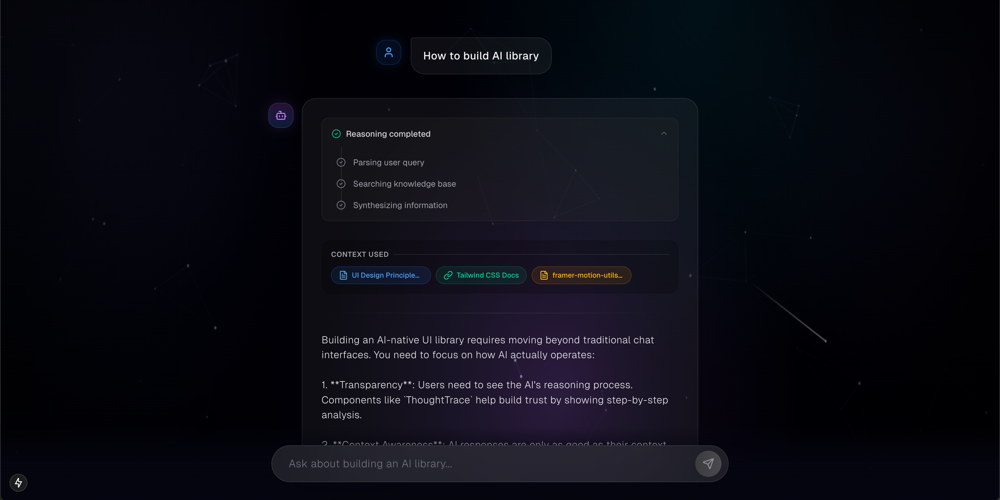

# Aura UI: The Future of AI-Native Interfaces 🌌



Aura UI is a premium, flagship-tier React component library designed specifically for the next generation of "Answer Engines." It moves beyond the traditional chatbot wrapper, providing a cinematic, contextual, and deeply transparent interface for AI interactions.

## 🚀 Key Features

### 1. **Cinematic Generative Backgrounds**
- **Living Canvas**: A 60fps canvas-based mesh gradient that functions like a custom WebGL shader.
- **Dynamic Aurora**: Slowly drifting, blending light blooms with organic fractal grain and interactive fluid motion.
- **Celestial Atmosphere**: Drifting star fields, shooting stars, and faint cosmic constellations that make the interface breathe.

### 2. **Deep Transparency: ThoughtTrace**
- **Inner Monologue**: Visualize the AI's reasoning process in real-time. 
- **Step-by-Step Clarity**: Users can see exactly how the AI parses queries, searches knowledge bases, and synthesizes final answers.
- **Staggered Animations**: Smooth transitions from "Thinking" to "Synthesizing" to build trust and accountability.

### 3. **Context Sensitivity: ContextLens**
- **Reference Visualization**: Elegantly display the exact citations and sources the AI used for its response.
- **Interactive Snippets**: Tap to explore the source material without losing the flow of the conversation.
- **Visual Credibility**: Prevents "hallucination anxiety" by grounding every answer in verifiable context.

### 4. **Fluid Delivery: StreamingText**
- **Typewriter Perfection**: A custom-built streaming component that eliminates the "janky" block-rendering typical of raw LLM outputs.
- **Natural Pacing**: Mimics human-like reading speeds with randomized typing cadences for a more comfortable experience.

### 5. **Premium Glassmorphism Design**
- **State-of-the-Art Aesthetics**: Utilizing high-end `backdrop-blur` techniques, sophisticated dark mode palettes (`#000008`), and glowing accent borders.
- **Framer Motion Micro-animations**: Every element enters with high-end spring physics, staggered staggers, and layout-preserving transitions.

## 🛠️ Tech Stack

- **Framework**: Next.js 15+ (App Router)
- **Styling**: Tailwind CSS
- **Animations**: Framer Motion
- **Backgrounds**: HTML5 Canvas & SVG Filters
- **Icons**: Lucide React

## 📦 Getting Started

### 1. **Clone the Repository**
```bash
git clone https://github.com/ItkalNagaratna/streaming-chat-UI.git
cd streaming-chat-UI
```

### 2. **Install Dependencies**
```bash
npm install
# or
yarn install
```

### 3. **Run Locally**
```bash
npm run dev
```

License: MIT
---
*Built with passion to redefine how we interact with intelligent systems.*
